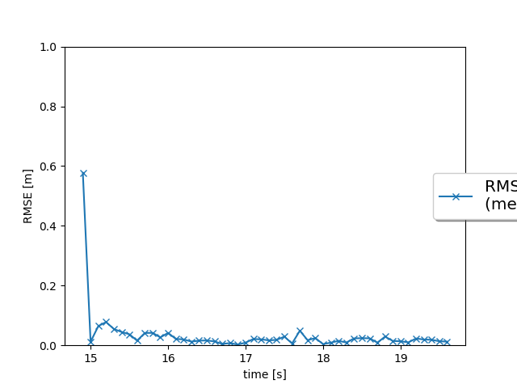
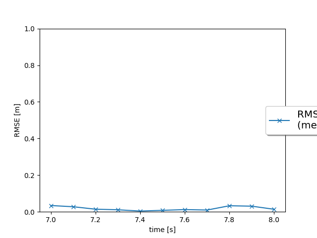
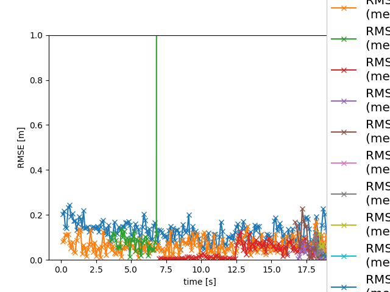
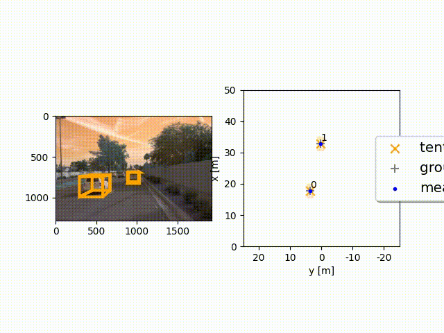

# Final Project

## 1. Recap of the Four Tracking Steps

**Step 1 (Filter)**

- **Implement System Matrix F** and **Process Noise Covariance Q**: I updated the filter to handle a 6D state vector. The `F()` function returns the constant-velocity transition matrix, and `Q()` computes the corresponding process noise covariance.
- **Predict and Update** : I wrote the `predict()` method to project the state/covariance forward in time, and the `update()` method to incorporate sensor measurements into the state (via **γ** and **S**).

**Step 2 (Track & Track Management)**

- **Track Initialization** : In the `Track` class, I replaced fixed initialization with a proper setup of `self.x` and `self.P` based on measurements transformed into vehicle coordinates.
- **Track Management** : In `Trackmanagement`, I handled unassigned measurements (creating new tracks) and unassigned tracks (decreasing scores, deleting stale or overly uncertain tracks). I also implemented logic to handle updated tracks, incrementing their score and transitioning them from “tentative” to “confirmed.”

**Data Association**
I use a single nearest-neighbor data association approach, guided by the Mahalanobis distance. For each frame, I build an association matrix between existing tracks and incoming measurements.

**Step 3 (Data Association)**

* **Association Matrix & Gating** : I built a single nearest neighbor association matrix in the `associate()` method by computing Mahalanobis distances for each (track, measurement) pair. I then used χ2\chi^2**χ**2-based gating to ignore improbable associations.
* **Finding Closest Pairs** : With `get_closest_track_and_meas()`, I located the minimum valid distance in the matrix, removed that row/column, and updated track assignments accordingly.
* **Mahalanobis Distance (MHD)** : I implemented the `MHD()` function to compute the distance needed for gating and track association.

**Step 4 (Camera Sensor)**

* **Camera Measurement Function** : I expanded the sensor model for the camera by implementing a nonlinear projection function (`get_hx`) and a Jacobian (`get_H`). I also updated the measurement class to incorporate camera measurement noise covariance.

### Results and Challenges

The tracking pipeline produced reasonably stable 3D tracks over time. Among all the tasks, I found deriving and implementing the camera model (and its Jacobian) to be the most challenging, because small mistakes in the projection math can significantly degrade results. Handling edge cases such as potential division by zero in camera projections also required extra attention.

## 2. Benefits of Camera-Lidar Fusion

In theory, combining camera and lidar data increases robustness because:

* **Lidar** excels at precise 3D distance measurements but struggles with texture or color.
* **Camera** offers rich visual context but can be sensitive to lighting conditions.

During my experiments, integrating camera measurements helped improve track consistency when lidar points were sparse or slightly occluded. Camera-lidar fusion also gives better situational awareness, since each sensor compensates for the other’s weaknesses.

---

## 3. Real-Life Challenges for Sensor Fusion

1. **Sensor Calibration** : Even minor miscalibrations in extrinsic parameters lead to large errors in fusion.
2. **Environmental Conditions** : Adverse weather such as rain or fog can degrade lidar returns and camera visibility.
3. **Complex Scenes & Occlusion** : Urban environments can have many objects overlapping, making association harder.
4. **Real-Time Constraints** : Managing high-volume sensor data at real-time rates adds computational complexity.

I observed a simplified version of these challenges, especially concerning transforms between the camera and vehicle frames.

---

## 4. Future Improvements

* **Motion Model Enhancements** : Adding acceleration or turn-rate elements might help with more dynamic objects.
* **Advanced Data Association** : Techniques like Joint Probabilistic Data Association (JPDA) or Multi-Hypothesis Tracking (MHT) could yield more robust results in crowded scenes.
* **Richer Camera Measurements** : Incorporating bounding box edges or object classification scores from camera data could refine updates.
* **Adaptive Noise & Gating** : Dynamically adjusting the process noise or gating thresholds based on real-time conditions might make the tracker more robust to changing environments.

Continuing to develop these aspects could further boost the accuracy and reliability of my 3D tracking system.
